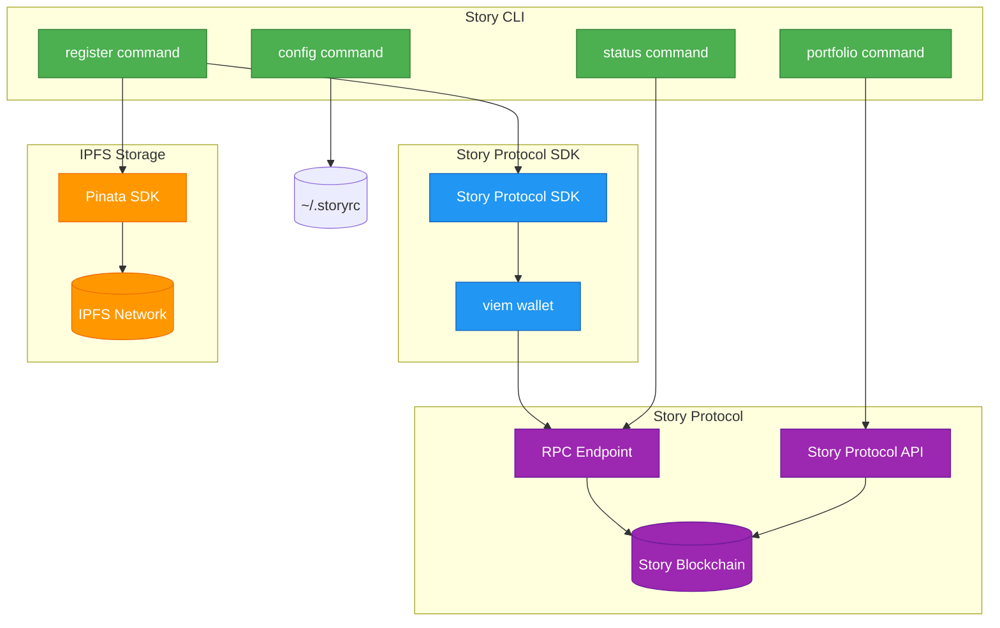

# Story CLI

[](https://opensource.org/licenses/MIT)

CLI tool for Story Protocol - Register and manage IP assets on the blockchain

## Overview

**Story CLI** is a unified command-line toolkit that transforms the developer experience for Story Protocol by providing guided workflows for the complete IP lifecycle—from registration through monitoring and distribution. Built for Story Protocol — the blockchain for programmable IP — this tool wraps Story Protocol's robust SDK functions in intuitive, interactive commands that make IP management feel like a conversation rather than a technical chore. Get your first IP asset registered in under 5 minutes with zero blockchain expertise required.

Learn more about Story Protocol at [https://docs.story.foundation](https://docs.story.foundation)

## Features

- **Interactive registration wizard** - Guided prompts walk you through license selection, metadata input, and transaction signing with smart defaults and validation
- **Multiple PIL license configurations** - Support for commercial use, derivatives permissions, and configurable royalty percentages (0-100%)
- **IPFS metadata storage integration** - Automatic metadata uploads to IPFS via Pinata with free tier support (1GB storage)
- **Blockchain transaction execution** - Seamless integration with Story Protocol SDK for secure IP asset registration on testnet or mainnet
- **Beautiful terminal UI** - Progress spinners, success celebrations with Boxen formatting, and color-coded output for exceptional developer experience
- **Persistent configuration management** - Secure config file storage at `~/.storyrc` with 600 permissions and environment variable overrides
- **Mock mode for offline development** - Test registration flows without blockchain transactions using `STORY_CLI_MOCK=true`
- **Debug mode with verbose logging** - Comprehensive troubleshooting with `--debug` flag showing SDK calls, API requests, and full stack traces

## Installation

### Prerequisites

Before installing Story CLI, ensure you have:

- **Node.js 18.0.0 or higher** - [Download from nodejs.org](https://nodejs.org/)
- **npm 9.0.0 or higher** - Comes bundled with Node.js
- **Ethereum wallet with private key** - For signing blockchain transactions
- **Pinata account** - Free tier available at [pinata.cloud](https://pinata.cloud) (provides 1GB IPFS storage)

**Note:** Start with Story Protocol testnet to avoid real gas costs during development and testing.

### Install globally

```bash
npm install -g story-cli
```

### Verify installation

```bash
story --version
```

You should see the current version number displayed. If the command is not found, ensure your npm global bin directory is in your PATH.

### Get testnet funds

For testing on Story Protocol testnet, get free testnet tokens from the faucet:

**Story protocol testnet faucet:** [https://faucet.story.foundation](https://faucet.story.foundation)

You'll need testnet funds to pay for gas fees when registering IP assets.

## Quick start

### First registration in under 5 minutes

Follow these steps to register your first IP asset on Story Protocol:

#### Step 1: Install the CLI

```bash
npm install -g story-cli
```

Verify installation:

```bash
story --version
# Output: 1.0.0
```

#### Step 2: Get testnet wallet and funds

1. Create an Ethereum wallet or use an existing one
2. Visit the Story Protocol testnet faucet: [https://faucet.story.foundation](https://faucet.story.foundation)
3. Request testnet tokens for gas fees

#### Step 3: Get Pinata API credentials

1. Sign up for a free Pinata account at [https://pinata.cloud](https://pinata.cloud)
2. Navigate to API keys section
3. Create a new API key and save both the **API key** and **API secret**

#### Step 4: Configure the CLI

Run the configuration wizard or set values individually:

```bash
# Interactive configuration wizard
story config set walletAddress 0x1234567890abcdef1234567890abcdef12345678
story config set network testnet
story config set pinataApiKey your_pinata_api_key_here
story config set pinataApiSecret your_pinata_api_secret_here
```

Verify your configuration:

```bash
story config get
```

Expected output:
```json
{
  "walletAddress": "0x1234567890abcdef1234567890abcdef12345678",
  "network": "testnet",
  "pinataApiKey": "your_pinata_api_key_here",
  "pinataApiSecret": "your_pinata_api_secret_here"
}
```

#### Step 5: Register your first IP asset

Run the interactive registration command with the path to your file:

```bash
story register ./my-artwork.jpg
```

Replace `./my-artwork.jpg` with the path to your actual file (image, audio, video, document, etc.).

You'll be guided through a series of prompts:

1. **License configuration:**
   - Allow commercial use? (Yes/No)
   - Allow derivatives? (Yes/No)
   - Royalty percentage? (0-100)

2. **Metadata input:**
   - IP asset name (e.g., "My first NFT collection")
   - Description (optional)
   - Image IPFS hash (optional)

3. **Transaction summary:**
   - Review license terms
   - View estimated gas costs
   - Confirm transaction

#### Step 6: View success message

After successful registration, you'll see:

```
┌──────────────────────────────────────────────────────┐
│                                                      │
│   🎉 IP Registration Successful!                    │
│                                                      │
│   IP ID: 123456789                                  │
│   Transaction: 0xabc123...def789                    │
│   View on Explorer:                                 │
│   https://aeneid.explorer.story.foundation/tx/...  │
│                                                      │
└──────────────────────────────────────────────────────┘
```

#### Metadata structure example

When you provide metadata, it's uploaded to IPFS in this format:

```json
{
  "name": "My First NFT Collection",
  "description": "A collection of unique digital artwork",
  "image": "ipfs://QmXXXXXXXXXXXXXXXXXXXXXXXXXXXXXXXXXXXXXXXXXX",
  "attributes": []
}
```

The CLI automatically handles IPFS upload via Pinata and returns the metadata hash for blockchain registration.

## Commands

Story CLI provides the following commands for managing IP assets on Story Protocol. All commands support the global `--debug` flag for verbose output.

### `story register`

Register a new IP asset on Story Protocol blockchain with interactive license wizard and metadata upload.

**Usage:**
```bash
story register <file-path> [options]
```

**Arguments:**
- `<file-path>` - Path to the file to register (required). This file will be validated for existence and readability before registration begins.

**Options:**
- `--metadata-hash <hash>` - Pre-uploaded IPFS metadata hash (skips metadata prompts and upload). Use this to retry failed transactions without re-uploading metadata.
- `--debug` - Enable debug mode with verbose output and stack traces

**Interactive workflow:**

When you run `story register`, you'll be guided through an interactive wizard:

1. **License configuration:**
   - Allow commercial use? (Yes/No)
   - Allow derivatives? (Yes/No)
   - Royalty percentage? (0-100%) - Only shown if derivatives are allowed

2. **Metadata input:**
   - IP asset name (required)
   - Description (optional)
   - Image IPFS hash (optional)

3. **Transaction summary:**
   - License type confirmation
   - Royalty percentage (if applicable)
   - Metadata IPFS hash
   - Network and gas estimate

4. **Blockchain transaction:**
   - Gas balance check
   - Transaction execution
   - Success confirmation with IP ID and explorer link

**Example usage:**

```bash
# Basic registration with interactive prompts
story register ./my-artwork.jpg

# Registration with debug output
story register ./my-song.mp3 --debug

# Retry failed transaction with existing metadata hash
story register ./my-artwork.jpg --metadata-hash QmXXX...ABC
```

**Environment variables:**
- `STORY_PRIVATE_KEY` - Private key for transaction signing (required)
- `STORY_CLI_MOCK` - Set to `true` for offline testing with mock data
- `PINATA_API_KEY` - Pinata API key for IPFS uploads
- `PINATA_API_SECRET` - Pinata API secret for IPFS uploads

**License configuration examples:**

1. **Non-commercial only:**
   - Commercial use: No
   - Result: Non-commercial social remixing (PIL) license

2. **Commercial with Derivatives (10% Royalty):**
   - Commercial use: Yes
   - Derivatives: Yes
   - Royalty: 10%
   - Result: Commercial Remix license with 10% royalty

3. **Commercial No-Derivatives:**
   - Commercial use: Yes
   - Derivatives: No
   - Result: Commercial Use license without derivative rights

**Expected workflow:**
```bash
$ story register ./my-artwork.jpg

# License prompts
✓ License configuration: Commercial Remix (10% royalty)

# Metadata prompts
✓ Metadata collected

# IPFS upload
⠋ Uploading metadata to IPFS...
✓ Metadata uploaded to IPFS: QmXXX...ABC

# Transaction summary
License Type: Commercial Remix
Royalty Percentage: 10%
Metadata Hash: ipfs://QmXXX...ABC
Network: testnet
Estimated Gas: 0.0002 ETH

# Gas check and transaction
✓ Gas balance sufficient: 0.5 ETH
⠋ Registering IP on Story Protocol [testnet]...

# Success!
┌──────────────────────────────────────────────────────┐
│   🎉 IP Registration Successful!                     │
│   IP ID: 123456789                                   │
│   Transaction: 0xabc123...def789                     │
│   View on Explorer:                                  │
│   https://aeneid.explorer.story.foundation/tx/...   │
└──────────────────────────────────────────────────────┘
```

### `story config`

Manage Story CLI configuration values stored in `~/.storyrc`.

**Subcommands:**

```bash
story config set <key> <value>   # Set a configuration value
story config get [key]           # Display configuration values (all or specific)
story config path                # Display path to configuration file
```

**Options:**
- `--debug` - Enable debug mode

**Examples:**

```bash
# Set configuration values
story config set walletAddress 0x1234567890abcdef1234567890abcdef12345678
story config set network testnet
story config set pinataApiKey your_api_key
story config set pinataApiSecret your_api_secret
story config set rpcUrl https://aeneid.storyrpc.io

# Get all configuration values
story config get

# Get specific configuration value
story config get walletAddress

# Display config file path
story config path
# Output: /Users/you/.storyrc

# Debug mode
story config get --debug
```

### `story status`

Check wallet connection and display account information.

**Usage:**
```bash
story status
```

**What it displays:**
- ✓ Wallet connection status
- Ethereum wallet address (truncated for security)
- Network (testnet/mainnet)
- RPC endpoint URL
- Gas balance in ETH
- Low gas warning (if balance < 0.001 ETH)

**Example output:**

```bash
$ story status

✓ Wallet connected

Address: 0x1234...5678
Network: testnet
RPC Endpoint: https://aeneid.storyrpc.io
Gas Balance: 0.500000 ETH
```

**Note:** Requires `STORY_PRIVATE_KEY` environment variable to be set.

### `story portfolio`

Generate an interactive HTML portfolio of your registered IP assets on Story Protocol.

**Usage:**
```bash
story portfolio [options]
```

**Options:**
- `--output <path>` - Specify HTML output location (default: `./story-portfolio.html`)
- `--show-full-ids` - Display full IP IDs and transaction hashes without truncation
- `--debug` - Enable debug mode with verbose output

**What it generates:**
- Interactive HTML dashboard with your IP assets
- Mermaid.js relationship graph showing parent-child IP dependencies
- Statistics panel (total assets, root assets, derivatives, licenses issued)
- Dark mode support with toggle
- Mobile-responsive design

**Prerequisites:**
- `STORY_PRIVATE_KEY` environment variable must be set
- `walletAddress` configured via `story config set walletAddress <address>`
- Active network connection to Story Protocol

**Example usage:**

```bash
# Generate portfolio with default output location
story portfolio

# Specify custom output path
story portfolio --output ./my-portfolio.html

# Show full IP IDs and transaction hashes
story portfolio --show-full-ids

# Debug mode for troubleshooting
story portfolio --debug
```

**Expected workflow:**
```bash
$ story portfolio

ℹ [TESTNET] Generating portfolio
⠋ Fetching IP assets [TESTNET]...
✓ Found 7 assets
⠋ Building visualization graph...
✓ Visualization graph built
⠋ Generating HTML portfolio...
✓ HTML portfolio generated

┌──────────────────────────────────────────────────────┐
│                                                      │
│   🎉 Portfolio Generated!                           │
│                                                      │
│   7 IP assets found                                 │
│   4 root, 3 derivatives                             │
│                                                      │
│   Output: ./story-portfolio.html                    │
│   Open in browser to view your portfolio            │
│                                                      │
└──────────────────────────────────────────────────────┘

⏱ Completed in 2.34s
```

**Empty portfolio:**

If no IP assets are found for your wallet:
```bash
$ story portfolio
ℹ No IP assets found for your wallet. Register your first IP with `story register`
```

**Sample output:**

See [examples/sample-portfolio.html](examples/sample-portfolio.html) for a demo portfolio showing 7 IP assets with derivative relationships, statistics dashboard, and interactive graph visualization.

### Global options

**`--help` / `-h`**
Display help information for any command:

```bash
story --help                    # Show all available commands
story register --help           # Show register command options
story config --help             # Show config command options
story status --help             # Show status command options
```

**`--version` / `-v`**
Display the current version of Story CLI:

```bash
story --version
# Output: 1.0.0
```

**`--debug`**
Enable debug mode with verbose output (works with all commands):

```bash
story register --debug
story config get --debug
story status --debug
```

Debug mode outputs:
- Verbose SDK calls
- API requests and responses
- Full stack traces
- Detailed validation steps

## Debug mode

Debug mode provides verbose output for troubleshooting issues with the CLI.

### Enabling debug mode

You can enable debug mode in two ways:

1. **Using the `--debug` flag:**
   ```bash
   story register --debug
   story config get --debug
   ```

2. **Using the `DEBUG` environment variable:**
   ```bash
   export DEBUG=true
   story register
   ```

### What debug mode outputs

When debug mode is enabled, you'll see:

- **Verbose SDK calls** - All Story Protocol SDK method invocations
- **API requests/responses** - Detailed logs of Pinata uploads, Goldsky queries, and other API calls
- **Full stack traces** - Complete error stack traces for debugging
- **Detailed validation steps** - Step-by-step validation output

### Example usage

```bash
# Enable debug mode for a register command
$ story register --debug

[DEBUG] Debug mode enabled
[DEBUG] Loading configuration from /Users/you/.storyrc
[DEBUG] Validating wallet address: 0x1234...5678
[DEBUG] Connecting to Story Protocol RPC: https://aeneid.storyrpc.io
...
```

## Troubleshooting

This section covers common errors you may encounter and how to resolve them. Each error follows a three-part format: what went wrong, why it matters, and how to fix it.

### Common errors

#### Missing configuration values

**Error:**
```
Pinata API key not found
Run `story config set pinataApiKey YOUR_KEY` or set PINATA_API_KEY environment variable
```

**What went wrong:** The CLI cannot find a required configuration value (Pinata API key, secret, or wallet address).

**Why it matters:** Story CLI needs these credentials to upload metadata to IPFS and sign blockchain transactions.

**How to fix:**

Option 1 - Set via config file:
```bash
story config set pinataApiKey YOUR_KEY
story config set pinataApiSecret YOUR_SECRET
story config set walletAddress YOUR_ADDRESS
```

Option 2 - Set via environment variables:
```bash
export PINATA_API_KEY="your_api_key"
export PINATA_API_SECRET="your_api_secret"
export STORY_PRIVATE_KEY="0xYOUR_PRIVATE_KEY"
```

#### Invalid wallet address format

**Error:**
```
Invalid wallet address format
Wallet address must be a valid Ethereum address (42 characters starting with "0x")
Example: 0x742d35Cc6634C0532925a3b844Bc9e7595f0bEb
```

**What went wrong:** The wallet address in your config doesn't match Ethereum address format requirements.

**Why it matters:** Blockchain transactions require properly formatted addresses to identify accounts.

**How to fix:**

1. Verify your wallet address is **exactly 42 characters** (including the `0x` prefix)
2. Check that it starts with `0x`
3. Contains only hexadecimal characters (0-9, a-f)
4. Update your config:
   ```bash
   story config set walletAddress 0x1234567890abcdef1234567890abcdef12345678
   ```

Valid example: `0x742d35Cc6634C0532925a3b844Bc9e7595f0bEb`

#### Network connectivity failures

**Error:**
```
Story Protocol RPC endpoint timed out
Check your internet connection or try a custom RPC URL
```

**What went wrong:** The CLI couldn't connect to Story Protocol's blockchain RPC endpoint within the timeout period.

**Why it matters:** Without RPC connectivity, you cannot read from or write to the blockchain.

**How to fix:**

1. **Check internet connection** - Verify you're online
2. **Wait and retry** - Temporary network issues often resolve in 30-60 seconds
3. **Use custom RPC URL** - If the default endpoint is down:
   ```bash
   # For testnet
   story config set rpcUrl https://aeneid.storyrpc.io

   # Or use environment variable
   export STORY_RPC_URL="https://your-custom-rpc.io"
   ```
4. **Check firewall** - Ensure your firewall isn't blocking HTTPS connections

#### Insufficient gas balance

**Error:**
```
Insufficient gas balance
Your wallet has 0.0001 ETH but needs at least 0.001 ETH for transactions
Get testnet funds: https://faucet.story.foundation
```

**What went wrong:** Your wallet doesn't have enough ETH to pay for blockchain transaction gas fees.

**Why it matters:** All blockchain transactions require gas fees to be processed by the network.

**How to fix:**

**For testnet:**
1. Visit the Story Protocol testnet faucet: [https://faucet.story.foundation](https://faucet.story.foundation)
2. Enter your wallet address
3. Request testnet tokens (free)
4. Wait 1-2 minutes for tokens to arrive
5. Verify balance: `story status`

**For mainnet:**
1. Purchase ETH from a cryptocurrency exchange
2. Transfer ETH to your wallet address
3. Ensure you have at least 0.001 ETH (sufficient for ~5 transactions)

#### Invalid IPFS hash format

**Error:**
```
Invalid IPFS hash format
IPFS hashes must start with 'Qm' or 'ipfs://'
Example: QmXXX...ABC or ipfs://QmXXX...ABC
```

**What went wrong:** The IPFS hash you provided doesn't match the expected format.

**Why it matters:** Story Protocol needs valid IPFS hashes to reference metadata stored on IPFS.

**How to fix:**

1. **Check hash format:**
   - Must start with `Qm` or `ipfs://`
   - Example: `QmT5NvUtoM5nWFfrQdVrFtvGfKFmG7AHE8P34isapyhCxX`
   - Full URI: `ipfs://QmT5NvUtoM5nWFfrQdVrFtvGfKFmG7AHE8P34isapyhCxX`

2. **Verify hash source:**
   - If you uploaded to Pinata, use the `IpfsHash` field from the response
   - Don't include HTTP gateway URLs (like `https://gateway.pinata.cloud/...`)

3. **Retry registration:**
   ```bash
   story register --metadata-hash QmYOUR_VALID_HASH
   ```

#### Transaction revert errors

**Error:**
```
Transaction reverted on blockchain
The transaction was rejected by the Story Protocol smart contract
```

**What went wrong:** The blockchain rejected your transaction during execution.

**Why it matters:** Your IP registration failed and you may have lost gas fees.

**How to fix:**

1. **Check gas balance** - Ensure you have sufficient ETH:
   ```bash
   story status
   ```

2. **Verify network** - Confirm you're on the correct network (testnet vs mainnet):
   ```bash
   story config get network
   ```

3. **Check wallet permissions** - Ensure your wallet has permission to interact with Story Protocol contracts

4. **Retry with existing metadata** - Avoid re-uploading to IPFS:
   ```bash
   story register --metadata-hash QmYOUR_HASH
   ```

5. **Enable debug mode** - Get detailed error information:
   ```bash
   story register --debug
   ```

6. **Contact support** - If the issue persists, report it with debug logs

#### Rate limiting (Pinata API)

**Error:**
```
Rate limit exceeded for Pinata
Too many requests to Pinata API. Wait 60 seconds and try again.
```

**What went wrong:** You've exceeded Pinata's API rate limits for your account tier.

**Why it matters:** The CLI cannot upload metadata to IPFS until the rate limit resets.

**How to fix:**

1. **Wait 60 seconds** - Rate limits typically reset quickly on free tier
2. **Use existing metadata hash** - Skip upload with `--metadata-hash` flag:
   ```bash
   story register --metadata-hash QmYOUR_EXISTING_HASH
   ```
3. **Upgrade pinata plan** - For higher rate limits, upgrade at [pinata.cloud](https://pinata.cloud)
4. **Reduce concurrent uploads** - Don't run multiple registrations simultaneously

#### Command not found / Typos

**Error:**
```
Unknown command: 'registr'
Did you mean 'register'?
```

**What went wrong:** You entered a command that doesn't exist, likely due to a typo.

**Why it matters:** The CLI can't execute non-existent commands.

**How to fix:**

1. **Check suggestion** - The CLI uses smart suggestions powered by didyoumean library
2. **Use correct command name** - Follow the suggestion provided
3. **View available commands:**
   ```bash
   story --help
   ```

Valid commands: `register`, `portfolio`, `status`, `config`

#### Installation permission errors

**Error:**
```
npm ERR! Error: EACCES: permission denied, mkdir '/usr/local/lib/node_modules/story-cli'
```

**What went wrong:** npm doesn't have permission to install global packages in the system directory.

**Why it matters:** Without proper permissions, Story CLI cannot be installed globally and the `story` command won't be available.

**How to fix:**

Option 1 - Fix npm permissions (recommended):
```bash
mkdir ~/.npm-global
npm config set prefix '~/.npm-global'
echo 'export PATH=~/.npm-global/bin:$PATH' >> ~/.bashrc
source ~/.bashrc
npm install -g story-cli
```

Option 2 - Use sudo (not recommended):
```bash
sudo npm install -g story-cli
```

Option 3 - Use npx without global install:
```bash
npx story-cli register ./my-file.jpg
```

#### Node.js version incompatibility

**Error:**
```
error story-cli@0.1.0: The engine "node" is incompatible with this module.
Expected version ">=18.0.0". Got "16.14.0"
```

**What went wrong:** Your Node.js version is older than the minimum required version (18.0.0).

**Why it matters:** Story CLI uses modern JavaScript features and APIs only available in Node.js 18+.

**How to fix:**

1. **Check your current version:**
   ```bash
   node --version
   ```

2. **Update Node.js:**
   - Download from [nodejs.org](https://nodejs.org/) (LTS version 20.x recommended)
   - Or use a version manager like nvm:
     ```bash
     nvm install 20
     nvm use 20
     ```

3. **Verify and reinstall:**
   ```bash
   node --version  # Should show v18.x.x or higher
   npm install -g story-cli
   ```

#### File not found (Register command)

**Error:**
```
File not found: ./my-artwork.jpg
Please provide a valid file path
```

**What went wrong:** The file path you provided to the register command doesn't exist or is inaccessible.

**Why it matters:** Story CLI needs to read the file to calculate its hash and include it in the IP registration metadata.

**How to fix:**

1. **Verify the file exists:**
   ```bash
   ls -la ./my-artwork.jpg
   ```

2. **Check the path:**
   - Use absolute paths to avoid confusion: `/Users/you/Documents/my-artwork.jpg`
   - Ensure no typos in the filename
   - Check file extension matches exactly

3. **Check permissions:**
   ```bash
   # File should be readable
   ls -la ./my-artwork.jpg
   # Should show 'r' in permissions: -rw-r--r--
   ```

4. **Try with quotes for paths with spaces:**
   ```bash
   story register "./My Artwork File.jpg"
   ```

#### Large file upload timeout

**Error:**
```
Request timeout: IPFS upload took longer than 60 seconds
Consider compressing your file or checking your internet connection
```

**What went wrong:** The file upload to Pinata/IPFS exceeded the timeout limit, typically due to large file size or slow connection.

**Why it matters:** The metadata cannot be stored on IPFS, blocking the IP registration process.

**How to fix:**

1. **Check file size:**
   ```bash
   ls -lh ./my-file.jpg
   # Recommended: Keep files under 50MB for reliable uploads
   ```

2. **Compress large files:**
   - Images: Use tools like ImageOptim, TinyPNG, or `convert` (ImageMagick)
   - Videos: Consider linking to external hosting instead of embedding

3. **Check internet connection:**
   - Test upload speed at speedtest.net
   - Try on a different network if available

4. **Retry the upload:**
   - Temporary network issues often resolve on retry
   - If IPFS upload succeeded before failure, use `--metadata-hash` to skip re-upload

#### JSON config parse error

**Error:**
```
Failed to parse configuration file
SyntaxError: Unexpected token '}' at position 156
```

**What went wrong:** The `~/.storyrc` configuration file contains invalid JSON syntax.

**Why it matters:** Story CLI cannot read your configuration, preventing all commands from working.

**How to fix:**

1. **View your config file:**
   ```bash
   cat ~/.storyrc
   ```

2. **Common JSON issues:**
   - Missing comma between properties
   - Trailing comma after last property
   - Unquoted string values
   - Single quotes instead of double quotes

3. **Validate JSON:**
   - Use [jsonlint.com](https://jsonlint.com) to check syntax
   - Or use jq: `jq . ~/.storyrc`

4. **Reset configuration:**
   ```bash
   # Backup and recreate
   mv ~/.storyrc ~/.storyrc.backup
   story config set network testnet
   story config set walletAddress YOUR_ADDRESS
   story config set pinataApiKey YOUR_KEY
   story config set pinataApiSecret YOUR_SECRET
   ```

#### Portfolio API unavailable

**Error:**
```
Failed to fetch IP assets from Story Protocol API
Network error: Unable to connect to indexer service
```

**What went wrong:** The Story Protocol indexer API (Goldsky/Story API) is temporarily unavailable or unreachable.

**Why it matters:** The portfolio command requires the indexer API to query your registered IP assets.

**How to fix:**

1. **Check internet connection:**
   ```bash
   curl -I https://api.storyprotocol.net
   ```

2. **Wait and retry:**
   - API services may have temporary outages
   - Wait 5-10 minutes and try again

3. **Check Story Protocol status:**
   - Visit [Story Protocol Discord](https://discord.gg/storyprotocol) for service announcements
   - Check if others are experiencing similar issues

4. **Use debug mode for details:**
   ```bash
   story portfolio --debug
   ```

5. **Verify network configuration:**
   ```bash
   story config get network
   # Ensure you're on the correct network (testnet/mainnet)
   ```

### Enable Debug Mode

When troubleshooting issues, debug mode provides comprehensive diagnostic information.

**How to Enable:**

Option 1 - Using `--debug` flag:
```bash
story register --debug
story config get --debug
story status --debug
```

Option 2 - Using `DEBUG` environment variable:
```bash
export DEBUG=true
story register
```

**What Debug Mode Shows:**

- **Verbose SDK calls** - All Story Protocol SDK method invocations with parameters
- **API requests/responses** - Complete HTTP requests to Pinata, Story Protocol APIs with response bodies
- **Full stack traces** - Detailed error traces showing exact failure points in code
- **Validation steps** - Step-by-step validation output for debugging input issues
- **Configuration loading** - Which config file is loaded and what values are used

**Security Note:** Private keys are never logged, even in debug mode.

**Example Debug Output:**

```bash
$ story register --debug

[DEBUG] Debug mode enabled
[DEBUG] Loading configuration from /Users/you/.storyrc
[DEBUG] Configuration loaded: {"network":"testnet","walletAddress":"0x1234..."}
[DEBUG] Validating wallet address: 0x1234567890abcdef1234567890abcdef12345678
[DEBUG] Connecting to Story Protocol RPC: https://aeneid.storyrpc.io
[DEBUG] Checking gas balance for: 0x1234567890abcdef1234567890abcdef12345678
[DEBUG] Gas balance: 0.5 ETH (sufficient)
[DEBUG] Uploading metadata to Pinata...
[DEBUG] Pinata API request: POST https://api.pinata.cloud/pinning/pinJSONToIPFS
[DEBUG] Pinata response: {"IpfsHash":"QmXXX...ABC","PinSize":256}
[DEBUG] Metadata uploaded: ipfs://QmXXX...ABC
[DEBUG] Initiating IP registration transaction...
[DEBUG] Transaction hash: 0xabc123...def789
[DEBUG] Waiting for transaction confirmation...
[DEBUG] Transaction confirmed in block 12345678
[DEBUG] IP registered with ID: 987654321
```

### Getting additional help

If you're still experiencing issues after trying the solutions above:

1. **Run command-specific help:**
   ```bash
   story --help
   story register --help
   story config --help
   story status --help
   ```

2. **Check Story Protocol documentation:**
   - [Story Protocol Official Docs](https://docs.story.foundation)
   - [Story Protocol TypeScript SDK](https://github.com/storyprotocol/story-protocol-sdk)

3. **Report issues:**
   - GitHub Issues: [https://github.com/Zolldyk/story-cli/issues](https://github.com/Zolldyk/story-cli/issues)
   - Include debug logs (with `--debug` flag output)
   - Specify your OS, Node.js version, and CLI version

4. **Check system requirements:**
   ```bash
   node --version    # Should be 18.0.0 or higher
   npm --version     # Should be 9.0.0 or higher
   story --version   # Current CLI version
   ```

## Configuration

### Config file location

Story CLI stores configuration in `~/.storyrc` with `600` file permissions (owner read/write only) for security.

To view the config file path:
```bash
story config path
```

### Configuration file format

The configuration file uses JSON format. Example:

```json
{
  "walletAddress": "0x1234567890abcdef1234567890abcdef12345678",
  "network": "testnet",
  "pinataApiKey": "your_pinata_api_key",
  "pinataApiSecret": "your_pinata_secret",
  "rpcUrl": "https://aeneid.storyrpc.io"
}
```

### Configuration fields

| Field | Required | Description | Example |
|-------|----------|-------------|---------|
| `walletAddress` | Yes* | Ethereum wallet address for signing transactions | `0x742d35Cc6634C0532925a3b844Bc9e7595f0bEb` |
| `network` | Yes | Target network: `testnet` or `mainnet` | `testnet` |
| `pinataApiKey` | Yes* | Pinata API key for IPFS metadata uploads | `your_api_key` |
| `pinataApiSecret` | Yes* | Pinata API secret for IPFS authentication | `your_api_secret` |
| `rpcUrl` | No | Custom RPC endpoint (uses defaults if not set) | `https://aeneid.storyrpc.io` |

\* Required for `story register` command

### Environment variable overrides

Environment variables take precedence over config file values:

| Environment Variable | Overrides Config Field | Use Case |
|---------------------|------------------------|----------|
| `STORY_PRIVATE_KEY` | `walletAddress` | Securely provide private key without storing in config |
| `PINATA_API_KEY` | `pinataApiKey` | CI/CD pipelines, temporary credentials |
| `PINATA_API_SECRET` | `pinataApiSecret` | CI/CD pipelines, temporary credentials |
| `STORY_RPC_URL` | `rpcUrl` | Use custom RPC endpoint without modifying config |

Example usage:
```bash
export PINATA_API_KEY="your_temp_key"
export PINATA_API_SECRET="your_temp_secret"
story register
```

### Config Commands

**Set a configuration value:**
```bash
story config set <key> <value>
```

Examples:
```bash
story config set walletAddress 0x1234567890abcdef1234567890abcdef12345678
story config set network testnet
story config set pinataApiKey your_pinata_api_key
story config set pinataApiSecret your_pinata_api_secret
story config set rpcUrl https://aeneid.storyrpc.io
```

**Get configuration values:**
```bash
# Display all config values
story config get

# Display specific config value
story config get walletAddress
```

**Display config file path:**
```bash
story config path
# Output: /Users/you/.storyrc
```

### Security best practices

⚠️ **IMPORTANT SECURITY WARNINGS:**

1. **Never commit your `.storyrc` file to git** - Add it to `.gitignore` immediately:
   ```bash
   echo ".storyrc" >> ~/.gitignore
   ```

2. **File permissions are automatically set to `600`** - Only the owner can read/write the config file

3. **Never log or share your config file** - It contains sensitive API credentials

4. **Use environment variables for private keys** - Never store private keys in the config file, use `STORY_PRIVATE_KEY` environment variable instead

5. **Rotate credentials regularly** - If you suspect your credentials are compromised, regenerate them immediately on Pinata and update your config

## Architecture decisions

### System architecture



**Data flow:**

1. **Registration flow:** `CLI → Pinata SDK → IPFS` (metadata storage), then `CLI → Story SDK → viem → RPC → Blockchain` (IP registration)
2. **Portfolio flow:** `CLI → Story Protocol API → Blockchain` (query registered assets)
3. **Status flow:** `CLI → RPC Endpoint` (check wallet balance and connection)
4. **Config flow:** `CLI → ~/.storyrc` (local file storage)

### Graph visualization: Mermaid.js 10.6.1

**Decision:** Mermaid.js 10.6.1 chosen for portfolio graph visualization.

**Rationale:**
- **Declarative syntax** reduces implementation complexity - diagrams defined as text, not imperative code
- **Native GitHub/Markdown support** - diagrams render in documentation automatically
- **Guaranteed MVP delivery** vs D3.js learning curve - simpler implementation with predictable timeline
- **Simpler fallback chain** - Mermaid → Hand-rolled SVG → HTML list hierarchy

**Limitations:**
- Less interactive than D3.js (no drag, zoom, pan)
- Requires client-side JavaScript for rendering in HTML
- Layout is automatic (less control than force-directed graphs)
- Limited styling options compared to custom SVG/Canvas

**Implementation:**
- Node.js generates Mermaid flowchart syntax strings
- HTML template includes Mermaid.js CDN script for client-side rendering
- Fallback: SVG tree layout if Mermaid fails; HTML nested list as ultimate fallback

## Frequently asked questions

### Why Story CLI vs. SDK directly?

Story CLI provides a **developer experience layer** on top of the Story Protocol SDK:

- **Interactive wizards** guide you through complex license configurations instead of writing boilerplate code
- **Smart defaults** for common use cases (testnet, standard licenses)
- **Built-in IPFS integration** via Pinata - no need to set up separate IPFS upload logic
- **Progress feedback** with spinners and success celebrations
- **Portfolio visualization** out of the box

**Use the SDK directly when:** You need custom integration logic, building a web app, or want programmatic control over every parameter.

**Use Story CLI when:** You want to quickly register IP assets, prototype ideas, or avoid writing blockchain integration code.

### How much does this cost?

**Testnet:** Completely free. Get testnet tokens from [faucet.story.foundation](https://faucet.story.foundation).

**Mainnet:**
- **Gas fees:** ~0.0002-0.001 ETH per registration (varies with network conditions)
- **IPFS storage:** Free via Pinata (1GB included on free tier)
- **Story CLI:** Free and open source

### Can I use this on mainnet?

Yes! Switch your network configuration:

```bash
story config set network mainnet
```

**Before using mainnet:**
1. Ensure you have real ETH in your wallet for gas fees
2. Double-check your IP metadata - mainnet registrations are permanent
3. Verify your Pinata storage isn't exhausted (1GB free tier)

### What file types can I register?

**Any file type.** Story CLI doesn't restrict file formats:
- Images: JPG, PNG, GIF, SVG, WebP
- Audio: MP3, WAV, FLAC, AAC
- Video: MP4, MOV, WebM
- Documents: PDF, TXT, DOCX
- Code: Any source files
- 3D: GLB, OBJ, FBX

The file itself isn't uploaded to the blockchain - only its metadata (name, description, hash) is stored on IPFS and referenced in the IP registration.

### How do I view my registered IP assets?

Use the portfolio command:

```bash
story portfolio
```

This generates an interactive HTML dashboard at `./story-portfolio.html` showing all your registered IP assets, their relationships, and license terms.

## Resources

### Official Documentation

- **[Story Protocol Official Docs](https://docs.story.foundation)** - Complete reference for Story Protocol APIs, blockchain concepts, and integration patterns. Authoritative source for all Story Protocol development.
- **[Story Protocol TypeScript SDK](https://github.com/storyprotocol/story-protocol-sdk)** - Official SDK used by Story CLI for blockchain interactions
- **[Pinata IPFS Documentation](https://docs.pinata.cloud)** - Guide for IPFS storage and Pinata API usage

### Story Protocol Network Resources

- **[Story Protocol Testnet Faucet](https://faucet.story.foundation)** - Get free testnet tokens for development and testing
- **[Story Protocol Testnet Explorer](https://aeneid.explorer.story.foundation)** - View transactions, IP assets, and blockchain activity on testnet
- **[Story Protocol Mainnet Explorer](https://explorer.story.foundation)** - View mainnet transactions and IP registrations

### Built With

Story CLI is built with modern, production-ready technologies:

#### Core Framework
- **[Node.js 20.11.0 LTS](https://nodejs.org/)** - JavaScript runtime
- **[TypeScript 5.3.3](https://www.typescriptlang.org/)** - Type-safe language for development
- **[Commander.js 11.1.0](https://github.com/tj/commander.js)** - CLI framework for command routing

#### User Experience
- **[Inquirer.js 9.2.12](https://github.com/SBoudrias/Inquirer.js)** - Interactive command-line prompts
- **[Chalk 5.3.0](https://github.com/chalk/chalk)** - Terminal text styling
- **[Ora 7.0.1](https://github.com/sindresorhus/ora)** - Elegant terminal spinners
- **[Boxen 7.1.1](https://github.com/sindresorhus/boxen)** - Boxed messages for success celebrations

#### Blockchain & Storage
- **[Story Protocol SDK](https://github.com/storyprotocol/story-protocol-sdk)** - Official Story Protocol blockchain SDK
- **[viem 2.21.0](https://viem.sh/)** - Modern Ethereum library for wallet management
- **[Pinata SDK 2.1.0](https://docs.pinata.cloud/sdks/nodejs)** - IPFS file storage via Pinata

#### Development Tools
- **[Vitest 1.2.0](https://vitest.dev/)** - Fast unit testing framework
- **[ESLint 8.56.0](https://eslint.org/)** - Code quality linting
- **[Prettier 3.2.4](https://prettier.io/)** - Code formatting
- **[tsx 4.7.0](https://github.com/esbuild-kit/tsx)** - TypeScript execution for development

## License

MIT License

Copyright (c) 2024 Story CLI Contributors

Permission is hereby granted, free of charge, to any person obtaining a copy
of this software and associated documentation files (the "Software"), to deal
in the Software without restriction, including without limitation the rights
to use, copy, modify, merge, publish, distribute, sublicense, and/or sell
copies of the Software, and to permit persons to whom the Software is
furnished to do so, subject to the following conditions:

The above copyright notice and this permission notice shall be included in all
copies or substantial portions of the Software.

THE SOFTWARE IS PROVIDED "AS IS", WITHOUT WARRANTY OF ANY KIND, EXPRESS OR
IMPLIED, INCLUDING BUT NOT LIMITED TO THE WARRANTIES OF MERCHANTABILITY,
FITNESS FOR A PARTICULAR PURPOSE AND NONINFRINGEMENT. IN NO EVENT SHALL THE
AUTHORS OR COPYRIGHT HOLDERS BE LIABLE FOR ANY CLAIM, DAMAGES OR OTHER
LIABILITY, WHETHER IN AN ACTION OF CONTRACT, TORT OR OTHERWISE, ARISING FROM,
OUT OF OR IN CONNECTION WITH THE SOFTWARE OR THE USE OR OTHER DEALINGS IN THE
SOFTWARE.
